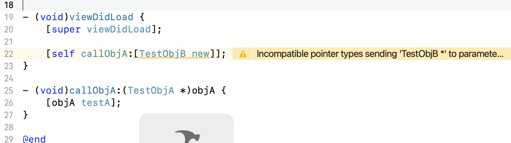

# Objective-C

## OC 是动态类型语言吗？OC 是强类型语言吗？为什么？

OC 是编译型、动态、鸭子类型语言。OC要先编译成二进制文件才能执行；编译期只进行简单的类型检查，类型不匹配只会有警告可以编译通过，到了运行期只要方法能得到执行就不会 crash。OC 是 C 语言的超集，继承了 C 语言的基本类型和控制流，增加了动态运行时和面向对象。



## 把一个 B 类型对象赋值给 A 类型可以吗？为什么？

可以，本质上就是把指针指向了另外一个堆空间，而指针变量的大小又都是相同的。

在改变指针类型以后可以继续调用原来类型的方法，编译期没问题，运行时如果在新类型没有对应方法会crash；也可以通过强转来调用新类型的方法，编译和运行都没有问题，但是必须要强转才能调用，否则编译不过，因为编译期并不知道类型改变了。

**Objective-C 是鸭子类型语言**

## OC 对象占用内存大小

- isa 指针大小 + 实例变量大小
- 最小是 16 字节，一个 isa 指针占用 8 字节，还需要内存对齐，所以就是最少 16 字节。

## OC 编译过程

1. preprocess 预处理
    - Tokenization: 符号化，标记源码中的每个字符串
    - 宏展开
    - `#include` `#import` 展开

2. Parsing and Semantic Analysic 解析和语义分析
    - 将预处理的符号翻译成解析树
    - 对解析树进行语义分析
    - 输出抽象语法树（AST：Abstract Syntax Tree）

3. Code Generation and  Optimization 代码生成和优化
    - 将抽象语法树翻译成低级中间码（LLVM IR）
    - 优化生成的代码
    - 生成特定目标（机器架构：arm64、x86-64）代码
    - 输出汇编代码

4. 汇编
    - 将汇编代码翻译成目标对象文件（target object file：.o）

5. 链接
    - 将多个目标文件合并成可执行文件（或者动态库）


### 程序在链接过程都做了什么？

链接过程将多个可重定位目标文件合并以生成可执行目标文件。链接的步骤：

- 符号解析。将符号的引用和符号的定义建立关联。
- 重定位。
  - 将多个代码段和数据段分别合并为一个单独的代码段和数据段；
  - 计算每个定义的符号在虚拟地址空间中的绝对地址；
  - 将可执行文件中的符号引用处的地址修改为重定位后的地址信息。

## copy vs strong

**strong 只是增加了引用计数**

**copy 会把对象进行复制，从而产生一个新对象，但是得到的是不可变对象**

**`strong` 用来修饰可变对象，`copy`用来修饰不可变对象。**

```
如果用`copy`修饰了一个可变对象，那么这个对象实际是不可变的，和用`copy`修饰不可变对象是一样的。

@property (nonatomic, copy) NSMutableArray *mArr;

NSMutableArray *arr1 = [NSMutableArray array];
self.mArr = arr1;
    
NSLog(@"arr1 = %p --- mArr = %p", arr1, self.mArr); // arr1 = 0x600001dce6d0 --- mArr = 0x1bbd878a8
NSLog(@"class1 = %@", [self.mArr class]); // class1 = __NSArray0
[self.mArr addObject:@"abc"]; // crash
```


```
@property (nonatomic, strong) NSMutableArray *mArr;

NSMutableArray *arr1 = [NSMutableArray array];
self.mArr = arr1;
    
NSLog(@"arr1 = %p --- mArr = %p", arr1, self.mArr); // arr1 = 0x600001e61d70 --- mArr = 0x600001e61d70
NSLog(@"class1 = %@", [self.mArr class]); // __NSArrayM
[self.mArr addObject:@"abc"];

NSArray *arr1 = [NSArray array];
self.mArr = arr1; // warning: Incompatible pointer types assigning to 'NSMutableArray *' from 'NSArray *'
// 使用 self.mArr = [arr1 copy] 同样有问题；使用 self.mArr = [arr1 mutableCopy] 没有问题
    
NSLog(@"arr1 = %p --- mArr = %p", arr1, self.mArr); // arr1 = 0x1bbd878a8 --- mArr = 0x1bbd878a8
NSLog(@"class1 = %@", [self.mArr class]); // __NSArray0
[self.mArr addObject:@"abc"];
```

```
使用 strong 修饰一个不可变类型，并把一个可变数组复制给它，此时 mArr 指向的是可变数组

@property (nonatomic, strong) NSArray *mArr;

NSMutableArray *arr1 = [NSMutableArray array];
self.mArr = arr1;

NSLog(@"arr1 = %p --- mArr = %p", arr1, self.mArr); // arr1 = 0x6000013e5da0 --- mArr = 0x6000013e5da0
NSLog(@"class1 = %@", [self.mArr class]); // __NSArrayM 
[arr1 addObject:@"a"];
NSLog(@"%@", self.mArr); // (a)
```


```
mArr 是拷贝了一份 arr1 导致两者的地址不同，并且mArr是不可变的

@property (nonatomic, copy) NSArray *mArr;

NSMutableArray *arr1 = [NSMutableArray array];
self.mArr = arr1;

NSLog(@"arr1 = %p --- mArr = %p", arr1, self.mArr); // arr1 = 0x60000153a7c0 --- mArr = 0x1bbd878a8
NSLog(@"class1 = %@", [self.mArr class]); // __NSArray0

[arr1 addObject:@"a"];
NSLog(@"%@", self.mArr); //
```


```
这时候两个地址是相同的，虽然用的是 copy 修饰 mArr，但是因为都是不可变类型，所以没必要增加一个新的指针

@property (nonatomic, copy) NSArray *mArr;

NSArray *arr1 = [NSArray array];
self.mArr = arr1;

NSLog(@"arr1 = %p --- mArr = %p", arr1, self.mArr); // arr1 = 0x1bbd878a8 --- mArr = 0x1bbd878a8
NSLog(@"class1 = %@", [self.mArr class]); // __NSArray0
```


## assign vs weak

- assign 直接简单赋值，不会增加对象的引用计数，用于修饰非Objective-C类型，主要指基本数据类型和C数据类型，或修饰对指针的弱引用。
- weak 修饰弱引用，不增加对象的引用计数，主要用于避免循环引用，和strong/retain对应，功能上和assign一样简单，但不同的是weak修饰的对象消失后会自动将指针置nil，防止出现“悬挂指针”。

## OC 支持函数重载吗？

OC 不支持函数重载，支持函数重写。

函数重载：方法名相同，参数不同，OC 是根据方法名进行调用的，所以不支持函数重载。

函数重写：子类重写父类函数。

## == isEqual hash

- == 运算符比较的是对象的地址是否相同。
- isEqual 默认也是比较两个对象的地址是否相同。
- hash 方法只在对象被添加至 `NSSet` 和设置为 `NSDictionary` 的 key 时会调用

```
证明默认情况下 isEqual 和 == 是一样的

NSObject *obj1 = [[NSObject alloc] init];
NSObject *obj2 = [[NSObject alloc] init];
NSLog(@"obj1 == obj2: %d", obj1 == obj2); // 0
NSLog(@"obj1 isEqual: obj2: %d", [obj1 isEqual:obj2]); // 0
```

### isEqual 的调用时机

除了直接调用 `isEqual:` 方法之外，数组等容器中也会通过调用 isEqual: 来判断两个对象是否相等。

### isEqual 和 hash 的关系

为了优化判等的效率, 基于hash的NSSet和NSDictionary在判断成员是否相等时, 会这样做

Step 1: 集合成员的 hash 值是否和目标hash值相等, 如果相同进入Step 2, 如果不等, 直接判断不相等
Step 2: hash值相同(即Step 1)的情况下, 再进行对象判等, 作为判等的结果。

## 可变数组的实现原理

可变数组在初始化的时候会默认申请一定数量的内存空间，当添加进去的元素到达一定数量的时候数组会增加空间，如果连续的空间不够用，数组会复制到一个新的可用位置。

## 怎么 hook 方法？怎么才能在不影响其他对象的条件下 hook 方法？

利用运行时在初始化之后修改对象 isa 指针，指向一个动态创建的子类对象（确保子类在整个运行时环境内是唯一，参考 KVO 底层实现），hook 时使用 isKindOf 判断。

## 类别（Category）和扩展（Extension）的区别

- 类别在运行期决议，扩展在编译期决议。

- 只能为已存在的类添加新的功能方法，而不能添加新的属性。类别扩展的新方法优先级更高，会覆盖类中同名的方法。

- 在同一个编译单元里我们的category名不能重复，否则会出现编译错误。

- 类别中声明了属性后不会自动合成 getter 和 setter 方法，扩展会自动合成

- 类别的作用：
  
  - 将类的实现分散到多个文件或者框架中
  
  - 创建对私有方法的前向引用
  
  - 向对象添加非正式协议

- 类别的局限性
  
  - 只能向原类中添加新的方法，且只能添加不能修改或者删除原方法，不能向原类中添加新的属性。类别中不能添加新的属性是因为OC程序编译后一个类的内存布局就确定了，运行期如果修改内存布局会有问题。
  
  - 类别添加的新方法全局有效且优先级最高，如果和原类方法重名，原来的方法会被覆盖。

## main 函数之前做的事

1. 加载可执行文件（App 的 .o 文件集合）
2. 加载动态链接库，进行 rebase 指针调整和 bind 符号绑定
   dyld 的时间线：Load dylibs → Rebase → Bind → ObjC → Initilizers
3. Objc 运行时的初始处理，包括 Objc 相关类的注册、category 注册、selector 唯一性检查等
4. 初始化，包括了执行 +load() 方法、attribute((constructor)) 修饰的函数的调用、创建 C++ 静态全局变量

## 动态库和静态库

1. Fat 文件：多个架构的静态库集合 .a 或 .framework 都可能是一个 fat 文件
2. Thin 文件：只包含单个架构的静态库
3. .a 文件由 .o 文件组成，.o 文件是编译器编译的产物，编译过程 .m → .i（汇编文件）→ IR（中间文件）→ .o （各个架构的 .o）
4. 静态库：链接时被完整复制到可执行文件中，本质上是一堆 .o 文件的集合
5. 动态库：本质上是没有 main 函数的可执行文件（二进制形式）。链接时不复制，在运行时动态加载。所以理论上动态库只用存在一份，多个程序可以动态的链接到这个动态库上面，可以节省内存，另外因为动态库不绑定在程序上，所以升级动态库比较容易。
6. iOS8 之前应用都是运行在沙盒中的并且只有但进程所以动态库没有用武之地。在 iOS8 之后由于 App Extension 和 Swift 的出现 iOS 就需要动态库了，但是这种动态库也只能在主 App 和 App Extension 之间共享，是动态库的一种阉割形式，苹果称之为 Embedded Framework。对于官方动态库 iOS 系统中只会存在一份，但是 App 自己的动态库还是会每个 App 单独存在。

## 优化应用启动时间

1. 减少类、分类数量，并把用不到的函数去掉
2. 减少 load 方法以及里面的逻辑
3. 减少 appDelegate 中 willFinish 和 didFinish 中的任务
4. 调整启动过程中需要调用的函数位置，尽量放到同一个内存页

## KVO 实现原理

KVO 的实现使用了 isa-swizzling 的技术。对象的 isa 指针指向的是类。当一个观察者注册了某对象的属性，这个被观察者的 isa 指针就会指向一个中间类而不是真正的类，该中间类实现了被观察类的set方法，set方法实现内部会顺序调用willChangeValueForKey方法、原来的setter方法实现、didChangeValueForKey方法，而didChangeValueForKey方法内部又会调用监听器的observeValueForKeyPath:ofObject:change:context:监听方法。

## `load` vs `initialize`

### 调用方式

load 是根据函数地址直接调用的，类似 C 语言的函数调用方式；

initialize 是通过 OC 的消息机制（objc_msgSend）进行调用的

### 调用时机

load 是在 runtime 加载类/分类时调用（只会调用一次）

initialize 是在类第一次接收消息的时候调用，每个类只会 initialize 一次（但是由于消息机制，父类的 initialize 可能会被调用多次）

### 调用顺序

load 是先父类再子类，先原类再分类，分类之间的顺序根据编译顺序确定

initialize 的顺序是先父类再子类，分类会覆盖原类（由于消息机制，和其他普通方法相同）

## Block

block 中捕获变量总是通过值传递的方式，不同之处在于传递的值不一样。全局变量不捕获，直接用。
对于普通局部变量直接传递值本身；对于静态局部变量传递的是变量地址的值；对于 __block 修饰的局部变量，会先创建新的结构体，这个结构体中包含该变量的值，block 结构体中持有这个新结构体的引用。

### Block 的本质

- Block 本质上是一个 C 的结构体，含有 isa 指针。使用 `[block class]` 可以得到 `xxxBlock` 的类名。

- Block 是封装了函数调用以及函数调用环境的 OC 对象。

### block 捕获变量

| 变量类型       | 是否捕获 | 访问方式 |
| -------------- | -------- | -------- |
| auto局部变量   | 是       | 值传递   |
| static局部变量 | 是       | 引用传递 |
| 全局变量       | 否       | 直接访问 |

### block 类型

| block 类型    | 环境               |
| ------------- | ------------------ |
| NSGlobalBlock | 没有捕获auto变量   |
| NSStackBlock  | 捕获了auto变量     |
| NSMallocBlock | StackBlock调用copy |

在 ARC 下会根据情况把 StackBlock 尽量优化成 MallocBlock，也就是进行 copy 
  - block 作为函数返回值
  - 被强指针引用时
  - block 作为 Cocoa API 中方法名含有 usingBlock 的方法参数时
  - block 作为 GCD 方法的参数时

### block 中修改外部变量的值

- 不能修改局部 auto 变量的值，是因为局部 auto 变量是通过值传递被 block 捕获的，block 中存放的是另外一份值，而不是原来的局部 auto 变量

- 可以修改局部 static 变量或者全局变量的值，是因为布局 static 变量是通过引用传递的，在修改的时候本质是通过指针进行的修改，而全局变量没有传递到 block 中而是直接访问的所以也能改。

- 使用 `__block` 修饰的 auto 局部变量也可以在block中修改是因为被修饰后的 auto 变量会被转换为一个对象传递到 block 中，修改时是通过这个对象访问到的 auto 变量值

### block 内存管理

- 基本数据类型的 auto 变量会通过值传递在 block 结构体中增加一个变量，这个变量跟随 block 结构产生、销毁

- 对象类型的 auto 变量或者被 __block 修饰的 auto 变量不会被栈上的 block 强引用

- 对象类型的 auto 变量如果是 **strong 的则会被堆上的 block 强引用而增加引用计数，当 block 销毁时会释放掉这个强引用；如果是 weak 的则不会被堆上的 block 强引用**

- 被 __block 修饰的 auto 变量会被堆上的 block 强引用，当 block 销毁时会释放掉这个强引用

- ARC 下使用 strong 和 copy 修饰 block 是没有区别的，都会把 block 拷贝到堆上

```
__weak void (^block)(void); // 由于 block 使用 __weak 修饰所以是一个弱指针，得到的就是一个栈上的block，如果没有 __weak 会得到一个 MallocBlock

// 这里面创建了一个临时 block，在这个临时 block 中捕获了 obj1 对象。并把这个临时 block 赋值给了外面的 block。
// 这个临时 block 在出了作用域（紧跟着的下面的大括号）后，就会被销毁了。
// 上面的 block 是一个__weak修饰的栈上的 block，不会给这个临时的 block 增加引用计数
// 所以当出了这个大括号以后，obj1 变量就没有引用了，就会被释放掉。
{
	MyObject *obj1 = [[MyObject alloc] init]; // obj1 没有被 block 强引用
	block = ^ { // warning: Assigning block literal to a weak variable; object will be released after assignment
		NSLog(@"obj1 = %@", obj1);
	};
}

NSLog(@"block = %@", [block class]);
block(); // 当 block 执行时 obj1 对象已经释放了
NSLog(@"end");
```

### 一个例子搞懂 Block
```
static NSInteger num3 = 300;

NSInteger num4 = 3000;

- (void)blockTest
{
    NSInteger num = 30;

    static NSInteger num2 = 3;

    __block NSInteger num5 = 30000;

    void(^block)(void) = ^{

        NSLog(@"%zd",num);//局部变量

        NSLog(@"%zd",num2);//静态变量

        NSLog(@"%zd",num3);//全局变量

        NSLog(@"%zd",num4);//全局静态变量

        NSLog(@"%zd",num5);//__block修饰变量
    };

    block();
}
```

编译后：

```
struct __WYTest__blockTest_block_impl_0 {
  struct __block_impl impl;
  struct __WYTest__blockTest_block_desc_0* Desc;
  NSInteger num;//局部变量
  NSInteger *num2;//静态变量
  __Block_byref_num5_0 *num5; // by ref//__block修饰变量
  __WYTest__blockTest_block_impl_0(void *fp, struct __WYTest__blockTest_block_desc_0 *desc, NSInteger _num, NSInteger *_num2, __Block_byref_num5_0 *_num5, int flags=0) : num(_num), num2(_num2), num5(_num5->__forwarding) {
    impl.isa = &_NSConcreteStackBlock;
    impl.Flags = flags;
    impl.FuncPtr = fp;
    Desc = desc;
  }
};

struct __Block_byref_num5_0 {
  void *__isa;
__Block_byref_num5_0 *__forwarding;
 int __flags;
 int __size;
 NSInteger num5;
};
```

## 通知 Notification

参考这个链接：[2020 最新iOS面试题之iOS通知机制全面解析](https://www.jianshu.com/p/5952c0a3fc62)

### 怎么判断两个通知是不是同一个通知

- 有name的通知，name和object相同才是同一个通知
- 没有name的通知，object相同是同一个通知
- name和object都没有的通知，那都是同一个通知

### 通知发送

- 通知都是在同一个线程发送的，只不过可以分队列发送，起到延时的效果。

### NSNotificationQueue

- 依赖`runloop`，所以如果在子线程使用`NSNotificationQueue`，需要开启runloop。
- 最终还是通过`NSNotificationCenter`进行发送通知，所以这个角度讲**它还是同步的**。
- 所以异步，指的是非实时发送而是在合适的时机进行发送，这个时机可以进行配置，并没有开启异步线程。


### 几个常见面试题

1. 实现原理（结构设计、通知如何存储的、name&observer&SEL之间的关系等）: 看上面的链接
2. 通知的发送时同步的，还是异步的：**同步**
3. NSNotificationCenter接受消息和发送消息是在一个线程里吗？如何异步发送消息：**是在一个线程，准确地讲没办法直接在发送消息是开启线程，但是可以把发送消息放到另一个线程。**
4. NSNotificationQueue是异步还是同步发送？在哪个线程响应：**同步发送，在当前线程响应。**
5. NSNotificationQueue和runloop的关系：**前者依赖后者**
6. 如何保证通知接收的线程在主线程：**使用带有线程的接收通知的API `- (id <NSObject>)addObserverForName:(nullable NSNotificationName)name object:(nullable id)obj queue:(nullable NSOperationQueue *)queue usingBlock:(void (NS_SWIFT_SENDABLE ^)(NSNotification *note))block`**
7. 页面销毁时不移除通知会崩溃吗：**iOS 9 之后就不会崩溃了，系统会自己移除。iOS9.0之前，会crash，原因：通知中心对观察者的引用是unsafe_unretained，导致当观察者释放的时候，观察者的指针值并不为nil，出现野指针.**
8. 多次添加同一个通知会是什么结果？多次移除通知呢：**多次添加会重复收到，多次移除不会crash。**