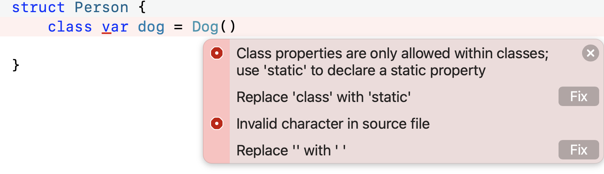

# Swift

## `struct` vs `class`

struct 是值类型，class 是引用类型

### 值类型和引用类型

- 值类型不能使用继承体系，引用类型可以。
- 值类型：struct、enum，引用类型：class、closure
- `let` 修饰的值类型不能在初始化之后修改内部变量的值，引用类型可以
- 内存管理：
    - 值类型的内存分配在栈上，引用类型分配在堆上
    - 值类型是线程安全的，因为每个线程都有自己的栈，不同线程之间不共享栈信息
    - 值类型（栈上）不需要引用计数，内存的申请和释放由栈处理，所以效率更高、速度更快

#### Swift中集合使用值类型的原因

- 值类型效率高
- 值类型线程安全

## 元组

- 元组可以存放不同类型的值
- 元组不是集合
- 元组可以通过映射来进行元素遍历

- **元组不能作为字典的key**，因为没有实现哈希协议。
- **元组的内存结构是连续的。**

## 可选型

可选型是为了表达一个变量为空的情况，在类型后面加问号？来定义可选型，或者直接使用`OPtional<>`。

值类型或者引用类型都可以是可选型变量。

可选型本质上是一个范型枚举。

## 存储属性和计算属性

**存储属性**：存储在实例对象的内存中，类似于成员变量。结构体和类可以定义存储属性，枚举不可以。

**计算属性**：本质就是方法，不占用实例对象的内存。枚举、结构体和类都可以定义计算属性。

## 延迟存储属性

使用 `lazy` 可以定义延迟存储属性，延迟存储属性不能用于计算属性。

`lazy` 属性必须是`var`，不能是`let`。

**如果多条线程访问`lazy`属性，无法保证属性只被初始化一次。**

## `static`和`class`的区别

- `static`可以用在值类型，`class`不可以
- `static`修饰的不可以被继承，`class`修饰的可以被继承



## 初始化器

- 结构体、枚举、类都可以定义初始化器。
- 初始化器分为：指定初始化器、便捷初始化器
- 规则：
    - 每个类至少有一个指定初始化器，指定初始化器是类的主要初始化器
    - 默认初始化器总是指定初始化器
    - 指定初始化器必须从它的直系父类调用指定初始化器
    - 便捷初始化器必须调用当前类的另一个初始化器
    - 便捷初始化器最终必须调用一个指定初始化器

## Swift 中的枚举

- 枚举可以内嵌到`struct` `class` `enum` 中
- 枚举中可以定义对象方法、类方法
- 枚举中可以使用计算属性

### Swift 枚举关联值和原始值

关联值 —— 将枚举的成员值跟其他类型的变量关联存储在一起

``` swift
enum Date {
    case digit(year: Int, month: Int, day: Int)
    case string(String)
}
```

原始值 —— 枚举成员变量使用相同类型的默认值预先关联，这个默认值就叫原始值

``` swift
enum Grade: String {
    case perfect = "A"
    case great = "B"
    case good = "C"
    case bad = "D"
}
```

**枚举支持的原始值类型**：整型、浮点数、字符串、布尔类型

### 枚举和`struct`的区别

- `struct` 中可以使用存储属性，`enum` 中不可以
- `enum` 可以使用模式匹配(`if case`)，`struct` 不可以

### 枚举的内存

- 没有关联值的枚举只占用一个字节，原始值的枚举始终占用一个字节
- 关联值的内存直接放在枚举内存中，所以枚举占用的内存空间包括所有关联值需要的内存空间
- 实际占用的内存还要考虑内存对齐

## Swift 和 OC 的联系

Swift 和 OC 共用一套运行时环境，Swift 可以桥接到 OC，反之亦然。

## Swift 和 OC 的区别

| 项目       | Swift                        | OC                |
| ---------- | ---------------------------- | ----------------- |
| 类型       | 强类型、静态                 | 弱类型、动态      |
| 范型       | 支持范型                     | 支持轻量范型      |
| 派发方式   | 静态派发、动态派发、消息派发 | 消息派发          |
| 函数式编程 | 支持                         | 不支持            |
| 高阶函数   | 支持                         | 不支持            |
| 元组       | 支持                         | 不支持            |
| 多返回值   | 支持                         | 不支持            |
| 函数重载   | 支持                         | 不支持            |
| 运算符重载 | 支持                         | 不支持            |
| 命名空间   | 支持                         | 不支持            |
| 默认参数   | 支持                         | 不支持            |
| 常量       | `let`常量，运行时确定        | `const`编译时确定 |

## Swift 派发机制

|             | 直接派发                                                     | 函数表派发                                                   | 消息派发                                                     |
| ----------- | ------------------------------------------------------------ | ------------------------------------------------------------ | ------------------------------------------------------------ |
| 含义        | 直接跳转到函数实现来执行                                     | 类中维护一个函数表，执行时需要查表后再跳转，这个表在编译时确定之后就无法更改了 | 类里面维护函数表，执行时查表并会沿着继承链寻找，运行时可以修改这个表 |
| 效率        | 最高                                                         | 中等                                                         | 最差。但是经过优化后可以达到近似于函数表派发                 |
| 举例        | C语言、C++默认                                               | C++虚函数                                                    | Objective-C                                                  |
| Swift中场景 | 值类型（Struct、Enum）/ final 关键字修饰的函数 / 没有被重写的私有函数 / Extension 中定义的函数 / static 修饰的函数 | 引用类型（Class）                                            | @objc + dynamic 修饰的函数                                   |

> 扩展中的方法不能被继承，所以是直接派发的

## Copy-on-Write

值类型在赋值时，新对象和原对象在内存中指向同一个对象，当且仅当修改其中之一时，才会在内存中产生一个新对象。

使用 Copy-on-write 可以提高赋值效率。

## 关键字

- `dynamic` 增加动态替换能力，不代表对 OC 可见

    ``` swift
    struct ModuleAStruct {
    
        dynamic func testModuleAStruct(){
            print("struct-testModuleAStruct")
        }
    }
    
    extension ModuleAStruct{
        @_dynamicReplacement(for: testModuleAStruct())
        func testModuleAStructReplacement() {
            print("extension-testModuleAStructReplacement")
        }
    }
    
    let foo = ModuleAStruct()
    foo.testModuleAStruct()
    
    ///通过调用测试打印出来的是
    extension-testModuleAStructReplacement
    ```

- `final`函数无法被重写，使用直接派发，对 OC 运行时不可见
- `@objc`将 Swift 函数暴露给 OC 运行时，依旧是函数表派发。
- `static` 类方法，方法使用直接派发的方式
- `lazy`指定延时加载（懒加载），懒加载存储属性只会在首次使用时才会计算初始值属性。懒加载属性必须声明（var）为变量，因为常量属性（let）初始化之前会有值。
    **lazy修饰的属性非线程安全的。**

## Swift 中的权限访问关键字

- Open：可以被其他Module访问和重写
- Public：可以被其他Module访问，但是不能被其他Module重写
- Internal：只能被当前Module访问和重写
- Fileprivate：只能被当前文件使用
- Private：只能在当前作用域中使用

## Swift 和 OC 混编问题

### 过多的隐式解包可选类型

OC 里面的指针如果不加修饰会解析成带 `!` 的隐式解包类型，如果字段为空就会 crash。

可以使用 `nonnull` `nullable` 修饰或者使用对应的宏。新建的类会自带这两个宏，对于遗留代码需要自己根据情况添加。

### 初始化器

OC 需要使用 `NS_DESIGNATED_INITIALIZER` 宏来指定*指定初始化器*，而便捷初始化器需要调用另一个初始化器，最终调用指定初始化器。

### 互相调用

#### OC 调用 Swift 

- 需要引入 `#import "工程名-Swift.h"
- Swift 类需要继承自 `NSObject`
- 在方法名前加 `@ojbc` 后 OC 才能调用
- Swift 中的枚举或结构体需要增加桥接

### 其他

- OC 的类不能继承自 Swift 类，反过来可以


**参考链接：**

[Swift函数派发机制](https://juejin.cn/post/6847009771845845006)

[Swift系列面试题总结](https://juejin.cn/post/6861804041085648910)