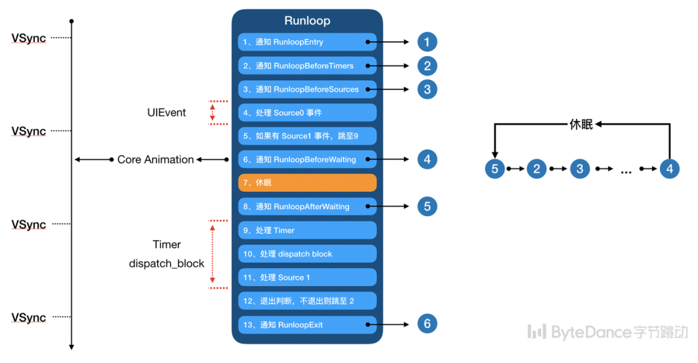

# Runloop


## 简述 runloop

Runloop 本质上就是一个 while 死循环，有了这个循环就可以确保线程永远不会结束，这个循环通过操作系统底层的函数来进行休眠和唤起，以此来节省消耗。

Runloop 主要的工作是接收并处理各种事件，包括创建和销毁自动释放池、处理点击事件、block回调、倒计时等等。

一个 Runloop 包含多个 mode，一个 mode 又包含多个 source、timer、observer。

线程和 Runloop 是一一对应的，它们的关系被保存在一个全局的 Dictionary 里。线程创建时并不会带有 Runloop，只有在第一次获取时才会创建。当线程结束时销毁 Runloop，除了主线程外，只能在线程内部获取对应的 Runloop。

### 为什么把 Timer 注册到 Common Mode？

common mode 是一种特殊的 mode，注册到这个 mode 的事件会自动分发到 commom modes 数组（比如 default mode 和 UITrackingMode）中其他的 mode 内

## Runloop 的使用场景

- NSTimer 不停止
- 线程保活
- 界面刷新
- 事件响应
- 自动释放池的创建和释放

## Runloop 和 线程 的关系

- Runloop 是基于线程进行管理的
- 主线程默认带有 runloop。子线程默认没有，只有当第一次在子线程中获取 runloop 时才会创建 runloop。
- runloop 和线程是一一对应的，它们之间的映射关系使用一个Dictionary进行保存。

## performSelector:withObject:afterDelay:

- 在当前线程执行，不会创建新线程
- 实现原理：使用定时器，等待 runloop 调用
- `afterDelay`参数设置的是最小时间，即使设置为0也不会立即执行。

	```
	- (void)viewDidLoad {
    [super viewDidLoad];
    /*
     下面代码的输出顺序：
     1
     3
     ViewController test
     */
    NSLog(@"1");
    
    [self performSelector:@selector(test) withObject:nil afterDelay:0];
    
    NSLog(@"3");
	}

  	- (void)test {
    	NSLog(@"ViewController test");
	}
	```

## Runloop 自动释放池 线程

一个线程对应一个runloop，一个runloop中可以有多个自动释放池

## 其他

```
[self performSelector:@selector(test3) withObject:nil afterDelay:0];
dispatch_async(dispatch_get_main_queue(), ^{
	NSLog(@"---111");
});
```

会先执行 dispatch_async 中的内容，再执行 performSelector:withObject:afterDeley: 中的内容。是因为 runloop 中会先处理 GCD 再处理定时器。